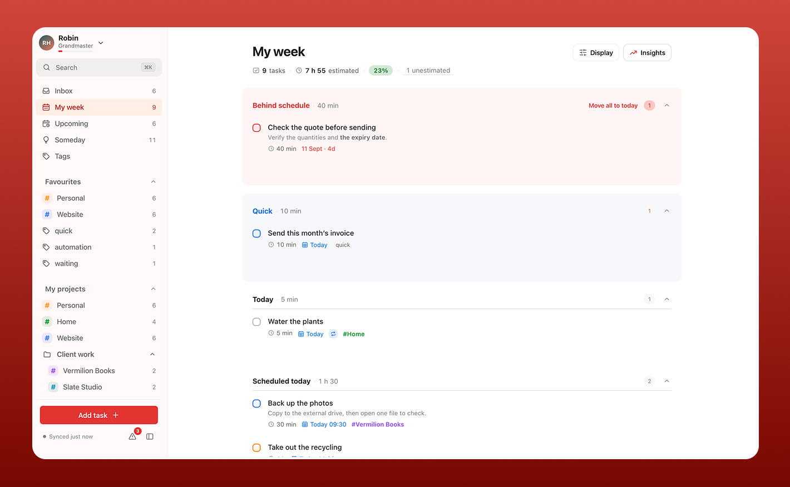
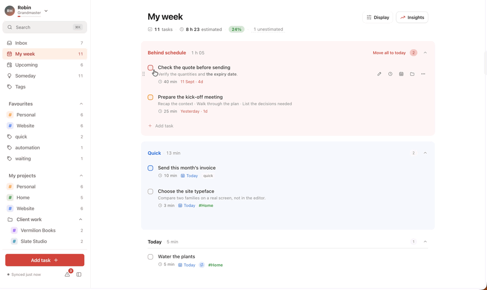
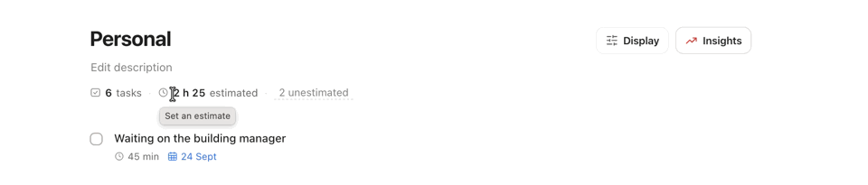
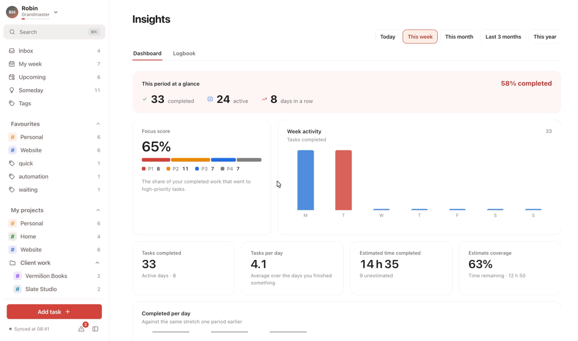
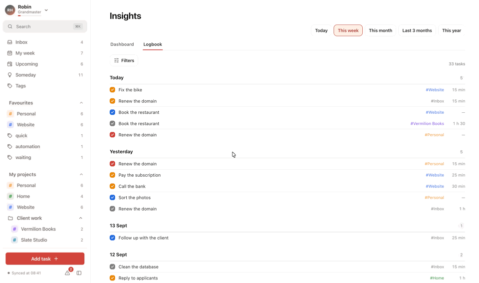

<div align="center">

# Enhanced for Todoist

A different front end for Todoist. Todoist stays the backend; this replaces the
interface with one built around planning a week.

**Enhanced for Todoist is an independent project. It is not created by,
affiliated with, or supported by Todoist.**

[Open it](https://todoistenhanced.julesbertolino.fr) · [Features](#features) ·
[Contributing](#contributing) · [Report a bug or an idea](https://tally.so/r/WOLkVN) ·
[Disclaimer and trademarks](#disclaimer-and-trademarks) ·
[License](#license) · [Buy me a coffee](https://buymeacoffee.com/julesbertolino)



</div>

---

## Why I built it

Todoist is a good product, but it plans one day at a time. My weeks don't work
like that. I commit to things without knowing which afternoon they'll land on,
I want to see whether Thursday is already full before I agree to anything else,
and I want to look back at the end of the week and see where the time went.

This reads the same data differently. Every change is written back to Todoist.
Anything the app adds is stored in properties Todoist already has: an estimate
becomes a label, "anytime this week" becomes a label, and the rest is projects,
sections, priorities and dates. Open the official app afterwards and nothing
will look unusual. If this project stopped working tomorrow your data would be
unaffected, because it never lived anywhere else.

> This is an independent project. It is not created by, affiliated with, or
> supported by Todoist, and it is not an official Todoist product. See
> [Disclaimer and trademarks](#disclaimer-and-trademarks).

## Try it without an account

It runs at **[todoistenhanced.julesbertolino.fr](https://todoistenhanced.julesbertolino.fr)**.
The connect screen has an "Explore with demo data" button. It loads a made-up
workspace so you can look around without a token. Nothing is sent anywhere.

---

## Features

### Planning a week rather than a day

My week splits the week into five buckets: behind schedule, quick, today,
scheduled today, and anytime this week. That last one holds the work you've
committed to without pinning it to a particular day, which is most of it.



### Estimates and workload

Write down how long a task will take. Each page then shows how many tasks are
on it, how much time that adds up to, and what proportion of the capacity you
set for that day or week. A parent task with no estimate of its own adds up its
subtasks. Anything still unestimated is listed in one place so you can fill
them in together.



### Looking back

The dashboard changes with the period you pick. A single day shows the hours
you finished things in. A week adds the shape of the week and a comparison
against the previous one. A year reads month by month. Arrows step back to
the week or month before, and either date can be edited to make your own
range.

It also carries a focus score, which weights what you finished by its priority.
It answers whether your effort went to the work that mattered or to everything
else.



### Logbook

What you actually finished, grouped by day, filterable by several projects and
priorities at once.



### Adding tasks

Type something like `Call Marc tomorrow at 9h p1 #Work @quick`. The date, the
project, the priority and the tag are highlighted inside the field as you type,
so you can see what will be picked up before you save. Typing `@` or `#` opens
the matching list. Subtasks can be typed in the same dialog and are created
along with the parent.

Reading dates from the text can be switched off in settings. `#project`, `p1`
and `@tag` are explicit syntax and always apply.

### Things to settle

Some contradictions can't be resolved automatically: a task that is both dated
and labelled for the week, a task carrying two estimates, a "quick" task
estimated at forty minutes. These are listed with the options that match each
possible intent, and nothing changes until you choose one.

### Daily and weekly review

A planning tool is only worth having if you look at it, and looking at
everything at once is what stops people. The review asks one question at a
time, in an order, with an end.

The daily pass takes a few minutes: what is late, what is sitting in the
Inbox, what you committed to this week without naming a day, and what today
holds. Each row offers the same three answers — today, this week, or the
backlog — and the one the task is already in is marked, so leaving it alone
reads as a decision rather than as not answering. Pressing one makes exactly
the change dragging the task there would make.

The weekly pass is longer: what you finished — in a list you can order by date
or by priority, with nothing crossed out, because a review is no place to read
your own week struck through — then the same week counted, then what slipped,
what is still unfiled, what is in play with no estimate (with the field right
there on the row), which projects have gone quiet, and the backlog. When the
last question is answered it says so and stops.

Any task in a review can be ticked off. Sometimes the answer is that you
already did it.

It stores nothing of its own. There is no per-project review interval here,
because there is nowhere in Todoist to keep one, and a review that needs its
own hidden state is a review that breaks the promise the rest of this makes.

### Also included

- Upcoming, Someday and Inbox views, plus project and tag pages. Tags can be
  dragged into your own order, which is also the order of the sidebar's
  favourites.
- List and board modes, with grouping, sorting and filtering behind a single
  Display control. A board with more columns than fit scrolls sideways.
- Drag and drop, where each destination has one fixed meaning and every drop
  can be undone.
- Search (`⌘K`) across tasks, projects and tags, usable from the keyboard.
- Markdown in descriptions, rendered in the list and in the task panel.
- Offline support: changes are queued and sent when you reconnect.
- English and French.

---

## Where your data goes

There is no server, no database and no account beyond your Todoist one. The
browser talks to the Todoist API directly. Your token is stored in your own
browser and is only ever sent to Todoist.

| What | Where it is stored |
| --- | --- |
| Todoist token | `localStorage`, on that device only |
| Copy of your workspace | IndexedDB, kept current by incremental sync |
| Preferences and per-view settings | IndexedDB |
| Changes made offline | An IndexedDB outbox, replayed on reconnect |

## Built with

React 18, TypeScript and Vite. Zustand for state, `idb` for IndexedDB,
`@dnd-kit` for drag and drop, `date-fns` for dates, and `vite-plugin-pwa` so it
can be installed as an app. No UI or CSS framework.

```bash
npm install
npm run dev      # Node 20+, pinned in .nvmrc
npm run build    # produces a static site in dist/
```

---

## Contributing

I built this for myself, so it is shaped around one person's habits. That is
the main thing it needs help with.

- If you have an idea, open an issue and describe how you plan your week. The
  most useful thing you can tell me is what you do that this app makes
  difficult.
- Bug reports are welcome, with or without a fix attached.
- No GitHub account, or would rather not open an issue? There is a short form:
  **[submit a bug or an idea](https://tally.so/r/WOLkVN)**. It is the same form
  the app links to from the user menu, and it reaches me just as well.
- Pull requests are open. The rules live in `src/domain` and depend on nothing
  else, so most behaviour can be changed without touching the interface.

If it saves you time, you can [buy me a
coffee](https://buymeacoffee.com/julesbertolino).

## Changelog

[CHANGELOG.md](CHANGELOG.md) lists what changed in each version. Each version
is also a [release](https://github.com/julesvbertolino/todoist-enhancements/releases)
with a ready-to-host build attached.

## Disclaimer and trademarks

Enhanced for Todoist is an independent project. **It is not created by,
affiliated with, or supported by Todoist.** It is not an official Todoist
product and it carries no endorsement.

"Todoist" is a trademark of Todoist Inc. Any reference to it here is descriptive,
to say what this connects to, and implies no association. The project is named
in the `x for Todoist` form that Todoist's
[brand usage guidelines](https://developer.todoist.com/api/v1/#section/Developing-with-Todoist/Brand-usage)
ask of third-party apps, and the same statement appears on the sign-in screen
and under Settings, About, inside the app itself.

The app's icon, name and interface are its own work. No Todoist logo, icon or
other brand asset is used or reproduced anywhere in this project.

This project uses the public Todoist API as any account holder may. It asks for
your own personal API token, stores it in your own browser, and sends it to
nobody but Todoist. It is provided as is, with no warranty, and it is not a
support channel for Todoist: if something is wrong with your account or with
Todoist itself, ask Todoist, not me.

If anyone at Todoist would like something here changed, open an issue and I will
change it.

## License

[MIT](LICENSE).
